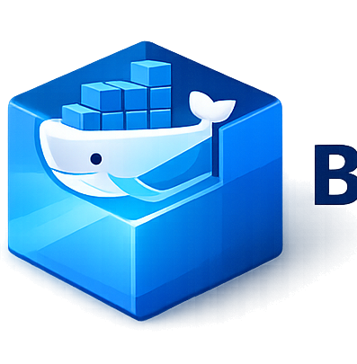

<div align="center">



# BC Container Creator

**Business-Central-Docker-Container per GUI erstellen und verwalten — ohne PowerShell, ohne `BcContainerHelper`-Knowhow.**

[](https://github.com/kaminarixo/BcContainerCreator/releases/latest)
[](LICENSE)
[](https://dotnet.microsoft.com/download/dotnet/10.0)
[]()

</div>

---

## Was ist das?

Ein Windows-Desktop-Tool, das Business-Central-Entwicklern, Consultants und Teams eine GUI für alles gibt, was sonst über `BcContainerHelper` per PowerShell läuft:

- **Voraussetzungen prüfen + automatisch fixen** (Docker, BcContainerHelper, ExecutionPolicy, PSGallery, Windows-Edition, …)
- **Container erstellen** mit Versions-Auswahl, MultiTenant, Memory-Limit, Isolation-Mode usw.
- **Container verwalten** — Liste mit Live-Status, Start, Stop, Löschen, Web-Client öffnen, Logs ansehen
- **Zugangsdaten-Popup** pro Container (URL, User, Passwort) — Passwort lokal DPAPI-verschlüsselt
- **Standard-User-Modus** — App startet ohne UAC, einzelne Admin-Aktionen werden on-demand elevated (lokaler Admin via UAC-Prompt)

Entwickelt für Business-Central-Entwickler und Teams, die lokale BC-Container schneller, reproduzierbarer und ohne manuelle PowerShell-Schritte erstellen möchten.

---

## Download &amp; Installation

[**→ Aktuellen Setup von GitHub Releases laden**](https://github.com/kaminarixo/BcContainerCreator/releases/latest)

1. `BcContainerCreator-Setup-x.y.z.exe` herunterladen
2. Doppelklick → UAC-Prompt mit lokalem Admin (z. B. `.\admin`) bestätigen
3. .NET-10-Desktop-Runtime-Check — fehlt sie, öffnet das Setup automatisch die Download-Seite
4. Pfad-Auswahl, Start-Menü-Eintrag, optional Desktop-Icon
5. Fertig

### Voraussetzungen auf dem Zielrechner

- **Windows 10/11 Pro / Enterprise / Education** (Home unterstützt keine Windows-Container — der Diagnose-Tab markiert das)
- **.NET 10 Desktop Runtime (x64)** — der Installer prüft das und verlinkt den Download
- **Windows PowerShell 5.1** (auf Windows 10/11 standardmäßig vorhanden)
- **Docker Desktop im Windows-Container-Modus** — der Diagnose-Tab kann es per UAC-Prompt installieren / umschalten

---

## Features

### Diagnose

13 Voraussetzungs-Checks mit fixbaren Aktionen:

- Ausführungs-Kontext (Admin / Standard-User)
- Windows-Edition (Pro/Enterprise/Education vs. Home)
- PowerShell-Version + ExecutionPolicy
- NuGet-Provider, PSGallery-Trust
- Docker installiert / läuft / im Windows-Modus
- BcContainerHelper-Modul installiert + Berechtigungen (ProgramData, hosts, docker-Group)
- Kein konkurrierendes Legacy-Modul (`navcontainerhelper`)
- Externer PowerShell- + BcContainerHelper-Smoke-Test (lädt das Modul in einem `powershell.exe`-Subprozess und ruft `Get-BcArtifactUrl` auf — wenn dieser Check grün ist, läuft auch `New-BcContainer` durch)

Fixes laufen mit `Microsoft.PowerShell.PSResourceGet` (modern). Wo nötig wird automatisch via UAC eskaliert.

### Container erstellen

- Versions-Dropdown mit `latest` + den letzten BC-LTS-Majors inkl. konkret aufgelöstem Build
- Country-Dropdown (DE/W1/AT/CH/US/…)
- Auth-Typ: `NavUserPassword` (Default) oder `Windows`
- Username default = aktueller Windows-User; Passwort mit Show/Hide-Toggle
- Optionaler Lizenz-Pfad
- Erweiterte Optionen: MultiTenant, TestToolkit, Memory-Limit, Isolation-Mode
- Live-Output rechts mit Brand-Spinner-Overlay
- Stufenbasierte Progress-Anzeige (`New-BcContainer` liefert keine echte Prozent-API — die App mappt bekannte BcContainerHelper-Statuszeilen auf grobe Etappen)
- Schließen während Erstellung läuft → Confirm-Dialog mit Cancel-Option

### Container verwalten

- Auto-Refresh (10s) der Container-Liste
- Pro Container: **Web öffnen** (`http://&lt;name&gt;/BC?tenant=default`), **Info** (Zugangsdaten-Popup), **Logs** (separates Fenster mit tail-Selector), **Start / Stop**, **Löschen**

### Logging &amp; Diagnose

- File-Logs unter `%ProgramData%\BcContainerCreator\Logs\` — täglich rotierend, 14 Tage Retention
- stdout und stderr aus jedem `powershell.exe`-Aufruf werden in die App-Logs und den Live-Output gestreamt
- Live-Log-Tab mit Copy / Save / Auto-Scroll
- Settings-Tab mit App-Version, OS-Info, Log-Folder-Open

---

## Architektur

```
src/
  BcContainerCreator.Core/    Class Library — UI-frei, eine spätere CLI ist möglich
    PowerShell/                IPowerShellRunner (externer powershell.exe-Subprozess)
    Docker/                    IDockerService (CLI-Wrapper)
    Setup/                     IPreflightCheck + ISetupService + IElevationService
    Containers/                IContainerService + IContainerMetadataStore (DPAPI)
    Models/                    Records: ContainerCreateRequest, CheckResult, …

  BcContainerCreator.App/     WPF-Anwendung (.exe)
    ViewModels/                MVVM mit CommunityToolkit.Mvvm
    Views/                     UserControls + Modal-Windows
    Services/                  DialogService, DispatcherProgress, PasswordBoxAssistant

tests/
  BcContainerCreator.Core.Tests/    xUnit-Test-Suite (Services, Runner, Store, Mapper)
```

**Kern-Entscheidungen:**

- **Externer PowerShell-Runner** — jedes Skript läuft in einem frischen `powershell.exe`-Subprozess (Windows PowerShell 5.1). BcContainerHelper benötigt Reflection-/`Add-Type`-Pfade, die unter einer eingebetteten SDK-Engine nicht zuverlässig funktionierten — Windows PowerShell ist hier die robustere Wahl.
- **Kein sichtbares Konsolenfenster** — der Subprozess wird headless gestartet; stdout und stderr werden zeilenweise ausgelesen und in App-Logs sowie Live-Output gestreamt.
- **Aufrufe werden serialisiert** — ein `SemaphoreSlim` stellt sicher, dass nur ein Skript zur gleichen Zeit läuft, sodass sich Ausgaben aus parallelen Aktionen (Diagnose, Create, List) nicht vermischen.
- **Parameter-Übergabe per JSON-Datei im User-only-Verzeichnis** — Variablen (inkl. Passwörter) werden nie als Prozess-Argumente übergeben, sondern in eine kurzlebige Datei unter `%LOCALAPPDATA%\BcContainerCreator\runtime` geschrieben. Die Default-ACL von `%LOCALAPPDATA%` beschränkt den Zugriff auf den aktuellen User — ohne Race zwischen Datei-Anlage und ACL-Setzen; Passwörter selbst sind im Code `SecureString`.
- **Container-Metadaten verschlüsselt** — gespeicherte Passwörter im Metadata-Store sind via DPAPI (CurrentUser-Scope) verschlüsselt und nur durch den anlegenden Windows-User lesbar.
- **Stufenbasierter Progress** — `New-BcContainer` liefert keine Prozent-API; bekannte Statuszeilen aus dem BcContainerHelper-Output werden auf grobe Etappen (10 / 15 / 40 / 55 / 70 / 85 / 100 %) gemappt.
- **`asInvoker`-Manifest** — App läuft als Standard-User. Admin nur on-demand über `Verb=runas` (z. B. Docker-Modus-Switch).

---

## Selbst bauen

### Voraussetzungen

- [.NET 10 SDK](https://dotnet.microsoft.com/download/dotnet/10.0)
- Optional für den Installer: [Inno Setup 6](https://jrsoftware.org/isinfo.php) — `winget install --exact --id JRSoftware.InnoSetup --silent`

### Quick build

```powershell
dotnet restore
dotnet build
dotnet test
dotnet run --project src/BcContainerCreator.App
```

### Single-File-Publish

```powershell
dotnet publish src/BcContainerCreator.App `
  -c Release -r win-x64 `
  -p:PublishSingleFile=true `
  --self-contained false
```

### Bundle-Installer (Setup.exe)

Skript läuft sowohl unter Windows PowerShell 5.1 als auch unter PowerShell 7+:

```powershell
# Windows PowerShell 5.1 (auf jedem Windows 10/11 vorhanden):
powershell -NoProfile -ExecutionPolicy Bypass -File build/build-installer.ps1

# Oder PowerShell 7+, falls installiert:
pwsh build/build-installer.ps1

# optional: -Version 1.2.3
```

Voraussetzung: [Inno Setup 6](https://jrsoftware.org/isinfo.php) muss installiert sein (`winget install --exact --id JRSoftware.InnoSetup --silent`). PDB- und XML-Dokumentationsdateien werden vor dem Bundling automatisch entfernt.

→ `dist/BcContainerCreator-Setup-<version>.exe` (≈12 MB)

---

## Roadmap

Siehe [docs/ROADMAP.md](docs/ROADMAP.md) für geplante Verbesserungen, mögliche Erweiterungen und spätere Ideen.

---

## Danksagung

BC Container Creator wäre ohne die Arbeit folgender Projekte und Plattformen nicht möglich:

- **[BcContainerHelper](https://github.com/microsoft/navcontainerhelper)** — die zentrale PowerShell-Grundlage für die Automatisierung von Business-Central-Containern. Sämtliche Container-Operationen dieser App rufen unter der Haube `BcContainerHelper`-Cmdlets auf.
- **[Docker Desktop](https://www.docker.com/products/docker-desktop/)** — die Container-Plattform, auf der die erzeugten Business-Central-Container laufen.
- **[Microsoft Dynamics 365 Business Central](https://dynamics.microsoft.com/business-central/)** — das Zielsystem, für das die Container bereitgestellt werden.
- **[.NET](https://dotnet.microsoft.com/)** und **WPF** — die technische Basis der Anwendung.
- **[CommunityToolkit.Mvvm](https://github.com/CommunityToolkit/dotnet)**, **[Serilog](https://serilog.net/)**, **[Microsoft.Extensions.Hosting](https://learn.microsoft.com/dotnet/core/extensions/generic-host)** sowie **[xUnit](https://xunit.net/)**, **[FluentAssertions](https://fluentassertions.com/)** und **[Moq](https://github.com/devlooped/moq)** — die Open-Source-Bibliotheken, die App und Tests tragen.
- **[Inno Setup](https://jrsoftware.org/isinfo.php)** — der Installer-Builder für die Setup-Bundle-Erstellung.

> BC Container Creator ist ein unabhängiges Community-Tool und steht in keiner offiziellen Verbindung zu Microsoft, Docker oder dem BcContainerHelper-Projekt.

### Third-party licenses &amp; Marken

Die oben genannten Projekte und ihre Marken gehören ihren jeweiligen Eigentümern; deren Lizenzbedingungen gelten unverändert. „Microsoft", „Dynamics 365" und „Business Central" sind Marken oder eingetragene Marken der Microsoft Corporation. „Docker" ist eine Marke von Docker, Inc. Alle weiteren Produkt- und Firmennamen können Marken der jeweiligen Inhaber sein.

---

## Lizenz

[MIT](LICENSE) — Copyright © 2026 Thomas Scharf
